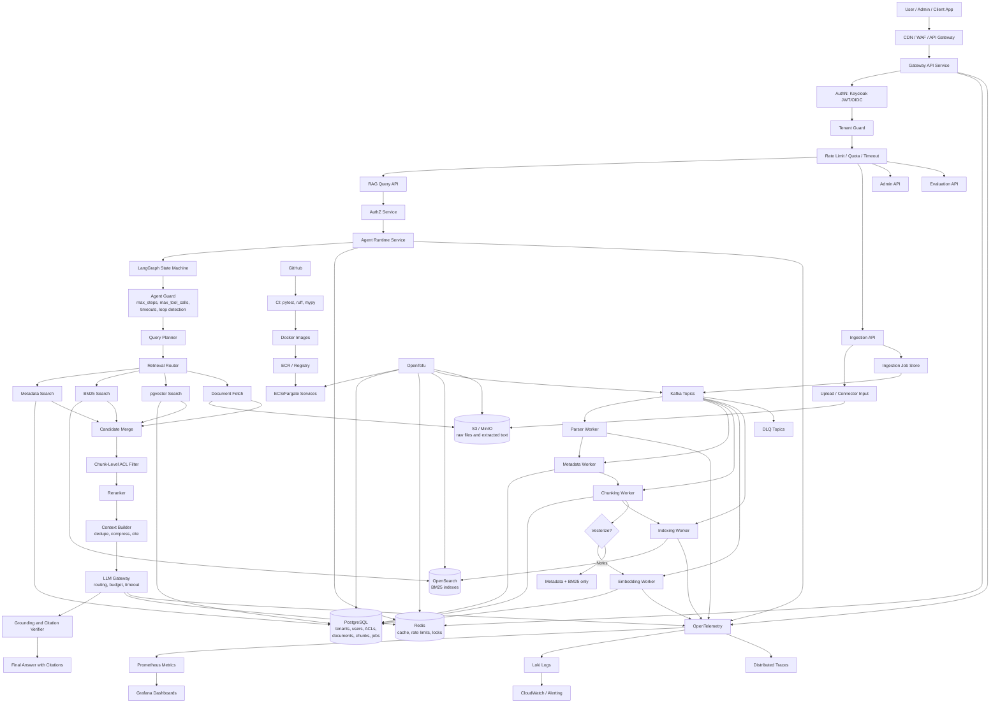
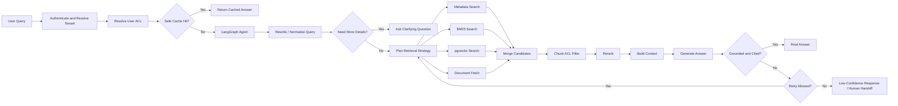

# Architecture

## Purpose

This repository implements a production-ready, microservices-based, multi-tenant
Agentic RAG platform for large datasets and high API traffic.

The design target is:

- Dataset size around 2 TB or more
- API traffic up to 10k RPS for gateway, metadata, cache, job status, and search
  paths
- Cost-controlled LLM, embedding, storage, and retrieval usage
- Metadata-first retrieval with BM25/full-text search
- Selective vectorization with pgvector
- LangGraph-based agent workflow with loop protection
- Chunk-level authorization before context reaches the LLM
- Async ingestion, indexing, embedding, and evaluation workers
- Production observability, reliability, and deployment readiness

Important production rule:

```text
10k RPS does not mean 10k direct LLM calls per second.
```

The API layer can scale horizontally for high traffic. Expensive paths such as
LLM calls, embedding generation, reranking, OCR, and deep hybrid retrieval must
be protected with caching, quotas, rate limits, backpressure, timeouts, circuit
breakers, and queues.

## Core Design

For a large dataset, the system should not vectorize everything by default.

The core retrieval strategy is:

```text
store raw data cheaply
-> extract metadata and ACLs
-> search metadata and BM25 first
-> use pgvector only for selected semantic chunks
-> rerank
-> build authorized context
-> generate grounded answer with citations
```

This gives a better production trade-off than blindly pushing the full dataset
into a vector database.

The target agentic query flow is:

```text
user query
-> planner decides what is needed
-> chooses tools
-> retrieval / web / metadata / document fetch / vector search
-> evaluates evidence
-> may retry or reformulate query
-> builds context
-> generates answer
-> verifies answer
-> returns citations
```

The first implementation can start with retrieval-only and deterministic
verification, but the platform direction is a planner-driven workflow that
chooses tools, evaluates evidence, and only returns answers grounded in
authorized context.

## Recommended Stack

This table is the implementation decision for this repository.

| Layer | Stack |
|---|---|
| Architecture style | Microservices from day one, managed in one repository |
| API framework | FastAPI |
| Agent workflow | LangGraph |
| Database | PostgreSQL |
| Vector extension | pgvector |
| ORM | SQLAlchemy |
| Migrations | Alembic |
| Cache and locks | Redis |
| Event streaming | Apache Kafka |
| Worker runtime | Python Kafka consumer services |
| Full-text search | OpenSearch BM25 |
| Object storage | MinIO locally, Amazon S3 in production |
| Authentication | Keycloak with JWT/OIDC |
| Authorization | Tenant, role, group, and chunk-level ACL |
| LLM gateway | LiteLLM |
| Local LLM runtime | Ollama |
| Embeddings | Sentence Transformers with `BAAI/bge-base-en-v1.5` |
| Reranker | `BAAI/bge-reranker-base` |
| Observability | OpenTelemetry, Prometheus, Grafana, Loki |
| Local runtime | Docker, Docker Compose, Makefile |
| Cloud infrastructure | OpenTofu |
| AWS production path | ALB, ECS/Fargate, RDS PostgreSQL, ElastiCache Redis, Amazon S3, OpenSearch, Amazon MSK, ECR, CloudWatch |

## Architecture Diagram



## Microservices

This project is built as microservices, not as a monolith.

The practical model is:

```text
one repository, multiple independently deployable services
```

Each service must have its own entrypoint, health endpoint, config, logs,
metrics, and deployment target. Services can share common libraries for schemas,
settings, logging, telemetry, auth helpers, and database primitives.

| Service | Responsibility |
|---|---|
| Gateway API | Public entry, auth forwarding, routing, rate limits |
| RAG Query API | Query endpoint, streaming response, request validation |
| Agent Runtime Service | LangGraph execution, checkpoints, loop safety |
| Retrieval Service | Metadata, BM25, pgvector, document fetch, reranking |
| LLM Gateway Service | Model routing, prompt policy, budgets, retries |
| Ingestion API | Uploads, connector inputs, ingestion job creation |
| AuthZ Service | Tenant, role, group, document, and chunk permission decisions |
| Worker Services | Parsing, metadata extraction, chunking, embedding, indexing |
| Evaluation Service | Retrieval tests, answer scoring, feedback analysis |
| Admin Service | Tenant, index, job, and operational management |

Service communication rules:

- Gateway-to-service calls use HTTP or gRPC contracts.
- Long-running work uses Kafka topics.
- Services do not import another service's internal business logic.
- Shared code stays in a `shared` package and must not hide service ownership.
- Database write ownership should be explicit for each table.

Recommended V1 structure:

```text
src/agentic_rag/
+-- shared/
|   +-- config.py
|   +-- logging.py
|   +-- security.py
|   +-- telemetry.py
|   +-- schemas/
|   +-- db/
|   +-- repositories/
|
+-- services/
|   +-- gateway_api/
|   +-- rag_query_api/
|   +-- agent_runtime/
|   +-- retrieval_service/
|   +-- llm_gateway/
|   +-- ingestion_api/
|   +-- authz_service/
|   +-- evaluation_service/
|   +-- admin_service/
|
+-- workers/
|   +-- parser_worker.py
|   +-- metadata_worker.py
|   +-- chunking_worker.py
|   +-- embedding_worker.py
|   +-- indexing_worker.py
|
+-- storage/
+-- ingestion/
+-- observability/
```

## Runtime Query Flow



The LLM must never receive chunks that the authenticated user cannot access.

## Data And Authorization Model

Authentication answers:

```text
Who is this user?
```

Authorization answers:

```text
Which documents and chunks can this user access?
```

Core identity and tenant fields:

```text
tenant_id
workspace_id
user_id
roles
group_ids
scopes
acl_version
data_region
```

Core tables:

```text
tenants
users
groups
roles
user_roles
documents
document_chunks
document_acl
chunk_acl
ingestion_jobs
agent_runs
agent_steps
agent_checkpoints
query_logs
retrieval_logs
tool_calls
evaluation_runs
feedback_events
```

Every retrievable record must carry tenant and authorization metadata:

```text
chunk_id
document_id
tenant_id
owner_user_id
allowed_user_ids
allowed_group_ids
allowed_roles
visibility
sensitivity
acl_version
classification_level
created_at
updated_at
```

Access filters must be applied in:

- PostgreSQL metadata queries
- OpenSearch filters
- pgvector queries
- Object storage fetch checks
- Candidate merge
- Final context builder

Permission-sensitive cache keys must include:

```text
tenant_id:user_id:acl_version:query_hash
```

## Retrieval Design

The retrieval system uses the cheapest reliable path that can answer the query.

Default order:

```text
metadata filter -> BM25 search -> selective pgvector search -> rerank
-> context builder -> grounded answer with citations
```

| Retrieval Mode | Best For |
|---|---|
| Metadata-only | Tenant, date, customer, product, owner, status, document type |
| BM25-only | Exact terms, CVEs, error messages, policy IDs, logs, file names |
| pgvector | Similarity, natural language discovery, related incidents |
| Hybrid | Real user questions needing filters plus semantic relevance |
| Agentic | Multi-step questions needing planning, tools, verification |

Selective vectorization rules:

- Do not vectorize the full 2 TB dataset by default.
- Deduplicate documents and chunks before embedding.
- Vectorize high-value, clean, frequently used, and semantically rich chunks.
- Keep old cold data as metadata and BM25 until semantic search is needed.
- Store embedding model, embedding dimension, text hash, and vector version.
- Re-embed only when source text, chunking policy, or embedding model changes.

## Ingestion Design

Ingestion is asynchronous and event-driven.

```text
upload or connector input
-> store raw file in S3/MinIO
-> create ingestion job
-> publish Kafka event
-> parse text and OCR when needed
-> extract metadata, entities, sensitivity, and ACLs
-> chunk and deduplicate
-> index text into OpenSearch
-> selectively embed into pgvector
-> update job status
```

Kafka topics:

```text
ingestion.parse
ingestion.metadata
ingestion.chunk
ingestion.embed
ingestion.index
rag.long_query
eval.batch
retry.ingestion
retry.embedding
retry.indexing
dlq.ingestion
dlq.embedding
dlq.indexing
dlq.rag
```

Each worker must define:

- Max concurrency
- Timeout
- Max retries
- Exponential backoff with jitter
- Idempotency key
- Retry topic
- DLQ topic
- Structured logs and trace context

## Agent Safety

The agent is a controlled LangGraph state machine, not an unlimited autonomous
loop.

Required controls:

- `max_steps`
- `max_tool_calls`
- Timeout per node
- Total workflow deadline
- Repeated action detection
- Allowed state transitions
- Confidence and grounding gates
- Checkpointing
- Human handoff path
- Monitoring alerts

Recommended initial limits:

```text
max_steps = 8
max_tool_calls = 12
step_timeout_seconds = 20
total_agent_timeout_seconds = 90
max_same_tool_repeat = 2
max_retries_per_node = 2
```

Agent state should include:

```text
step_count
tool_call_count
visited_nodes
last_tool_calls
last_results_hash
confidence_score
deadline_at
checkpoint_id
handoff_required
```

Safe fallback:

```text
I could not answer this confidently from the available authorized context.
```

## Reliability

Production controls:

| Control | Purpose |
|---|---|
| Rate limit | Protect tenants, users, providers, and infrastructure |
| Backpressure | Stop accepting slow work when queues or dependencies are saturated |
| Timeout | Prevent one dependency from blocking the request path |
| Retry | Recover from temporary failures |
| Circuit breaker | Stop calling unhealthy downstream systems |
| DLQ | Preserve failed jobs for inspection and replay |
| Idempotency key | Prevent duplicate writes and duplicate ingestion |
| Distributed lock | Prevent two workers from processing the same job |
| Bulkhead isolation | Keep one failing subsystem from taking down all traffic |

Degradation examples:

```text
Vector path unhealthy -> use metadata + BM25.
OpenSearch unhealthy -> use metadata + pgvector for allowed queries.
LLM quota exhausted -> return cached answer, retrieval summary, or 429.
Queue depth too high -> return 202 for ingestion or pause large uploads.
Low confidence -> return safe fallback instead of unsupported answer.
```

## Cost, Latency, And Performance

Main optimization rule:

```text
Use the cheapest reliable path that can answer correctly.
```

Cost controls:

- Use cache, metadata, and BM25 before LLM and vector search.
- Use small local models or rules for classification and routing.
- Use stronger models only for final synthesis when retrieval is good.
- Batch embedding requests.
- Deduplicate before embedding and indexing.
- Compress context before sending it to the LLM.
- Limit context chunks and answer tokens.
- Enforce tenant budgets and user rate limits.
- Track cost per successful answer.

Latency controls:

- Keep fast paths separate from slow paths.
- Run metadata, BM25, and pgvector retrieval in parallel for hybrid queries.
- Use Redis for permission maps, query plans, and safe cached answers.
- Use PgBouncer or managed database pooling.
- Use PostgreSQL read replicas for metadata-heavy reads.
- Rerank only top candidates.
- Stream final answers.
- Return `202 Accepted` for long-running jobs.

Initial latency targets:

| Path | Target |
|---|---|
| Health check | Under 50 ms |
| Cached answer | Under 100 ms |
| Metadata-only query | Under 200 ms |
| BM25 query | Under 500 ms |
| Hybrid retrieval before LLM | Under 1.5 seconds |
| First streamed token | Under 2 seconds when LLM is healthy |
| Long ingestion job | Async job with status API |

Throughput controls:

- Stateless service replicas behind ALB.
- Redis-backed rate limiting.
- OpenSearch shard planning by tenant and data volume.
- PostgreSQL indexes on tenant, ACL, status, timestamps, and hashes.
- pgvector table partitioning for large tenants.
- Batch writes to OpenSearch and PostgreSQL.
- Worker autoscaling based on queue depth and processing latency.
- Hot, warm, and cold data tiering.
- Load testing with k6 or Locust before claiming 10k RPS readiness.

## Observability

Use structured logs and distributed traces from the first version.

Every request, tool call, worker job, and LLM call should include:

```text
request_id
trace_id
tenant_id
user_id
route
agent_run_id
retrieval_strategy
tool_name
latency_ms
status
error_type
token_count
cost_estimate
```

Do not log secrets, access tokens, full private documents, sensitive chunks, or
full prompts with private context unless explicitly enabled for a secure debug
environment.

Metrics to track:

```text
cost_per_query
cache_hit_rate
metadata_only_query_rate
bm25_only_query_rate
vector_search_rate
llm_input_tokens
llm_output_tokens
reranker_latency_ms
llm_latency_ms
first_token_latency_ms
p95_api_latency_ms
p99_api_latency_ms
queue_depth
dlq_depth
postgres_latency_ms
opensearch_latency_ms
pgvector_latency_ms
authorization_denial_rate
agent_timeout_rate
```

Alerts should cover API error rate, P95/P99 latency, queue depth, DLQ depth,
agent timeout rate, circuit breaker state, LLM cost spikes, embedding cost
spikes, and authorization anomalies.

## Deployment

Local development runs with Docker Compose.

Local services:

```text
gateway-api
rag-query-api
agent-runtime
retrieval-service
llm-gateway
ingestion-api
authz-service
evaluation-service
admin-service
parser-worker
metadata-worker
chunking-worker
embedding-worker
indexing-worker
postgres
redis
opensearch
minio
kafka
otel-collector
```

Production deployment path:

```text
GitHub
-> CI: pytest, ruff, mypy
-> Docker images
-> ECR/container registry
-> ECS/Fargate services behind ALB
-> RDS PostgreSQL with pgvector
-> ElastiCache Redis
-> OpenSearch
-> Amazon S3
-> Amazon MSK
-> CloudWatch, OpenTelemetry, Prometheus, Grafana, Loki
```

OpenTofu should manage:

- VPC and subnets
- ALB
- ECS/Fargate services
- RDS PostgreSQL
- ElastiCache Redis
- OpenSearch
- Amazon S3 buckets
- Amazon MSK
- ECR repositories
- IAM roles
- Secrets Manager
- CloudWatch logs and alarms

## Scaling Plan

| Scale | Architecture |
|---|---|
| Local | Docker Compose with API services, workers, Postgres, Redis, OpenSearch, MinIO, Kafka |
| 1k RPS | Multiple service replicas, Redis cache, PostgreSQL connection pooling |
| 10k RPS | ALB, ECS/Fargate microservices, RDS PostgreSQL with pgvector, ElastiCache, OpenSearch, Kafka, worker autoscaling |
| 20k RPS | Stronger autoscaling, alarms, DLQs, tracing, cache tuning |
| 50k RPS | Separate queues, specialized worker pools, read replicas, stronger partitioning |
| 1 lakh users | Dedicated LLM Gateway, RAG Query API, Ingestion API, Evaluation Service |
| 10 lakh users | Tenant partitioning, Redis cluster, vector partitions, multi-region readiness |

## Roadmap

| Phase | Deliverable |
|---|---|
| 1 | Microservice folder structure, shared package, health endpoints, tests |
| 2 | Gateway API, RAG Query API, service contracts |
| 3 | PostgreSQL, SQLAlchemy, Alembic, tenant/document/chunk models |
| 4 | Keycloak JWT validation, ACL models, chunk permission filtering |
| 5 | Ingestion API and parser/chunker/metadata workers |
| 6 | Kafka consumer workers with retry and DLQ topics |
| 7 | Retrieval Service with OpenSearch BM25 and metadata filters |
| 8 | pgvector integration inside PostgreSQL |
| 9 | Agent Runtime Service with LangGraph guards and checkpoints |
| 10 | LLM Gateway with budgets, routing, timeouts, and retries |
| 11 | Reranker, context builder, answer verifier, citations |
| 12 | Structured logs, OpenTelemetry traces, metrics, alerts |
| 13 | Cost, latency, and performance dashboards |
| 14 | CI workflow, Docker Compose stack, OpenTofu skeleton |

## Final Architecture Summary

This repo implements a production-ready, microservices-based, multi-tenant
Agentic RAG platform where raw data is stored in object storage, metadata and
ACLs are managed in PostgreSQL, BM25 search is handled by OpenSearch, semantic
search is added selectively through pgvector, and LangGraph controls the
retrieval-agent workflow with safety guards, retries, observability, scalable
Kafka-based ingestion, and cost-aware LLM routing.

## References

- FastAPI larger app structure: <https://fastapi.tiangolo.com/tutorial/bigger-applications/>
- LangGraph overview: <https://docs.langchain.com/oss/python/langgraph>
- SQLAlchemy sessions and transactions: <https://docs.sqlalchemy.org/20/orm/session_transaction.html>
- Alembic migrations: <https://alembic.sqlalchemy.org/>
- pgvector: <https://github.com/pgvector/pgvector>
- OpenSearch search documentation: <https://docs.opensearch.org/docs/latest/search-plugins/>
- Apache Kafka documentation: <https://kafka.apache.org/documentation/>
- Keycloak documentation: <https://www.keycloak.org/documentation>
- LiteLLM documentation: <https://docs.litellm.ai/>
- Ollama documentation: <https://docs.ollama.com/>
- Sentence Transformers documentation: <https://sbert.net/docs/>
- BGE model documentation: <https://bge-model.com/bge/index.html>
- OpenTelemetry Python: <https://opentelemetry.io/docs/languages/python/>
- Docker Compose: <https://docs.docker.com/compose/>
- OpenTofu documentation: <https://opentofu.org/docs/>
