# Agentic RAG End-to-End Flow and Interview Guide

This document explains what happens in this `agentic_rag` project when a user
uploads a document and when a user chats with the system. It is written for
architecture and interview discussion, so it covers API flow, async processing,
chunk keys, BM25, vector indexing, hybrid retrieval, object storage, and the
current implementation limits.

## Current System Truth

Do not describe this repo as a MongoDB-based RAG system unless the
implementation is changed. The current implementation uses:

| Concern | Current implementation |
|---|---|
| API | FastAPI |
| Metadata DB | PostgreSQL through SQLAlchemy |
| Vector store | PostgreSQL with pgvector |
| BM25 search | OpenSearch |
| Object store | MinIO locally, S3-compatible API in production |
| Async processing | Kafka topics plus worker processes |
| Cache and rate/lock support | Redis |
| Agent runtime | LangGraph |
| LLM/embedding gateway | LiteLLM-facing gateway functions |

V1 ingestion currently supports UTF-8 text-like files such as `.txt`, `.md`,
`.json`, `.csv`, and similar MIME types. PDF/OCR/document-layout parsing is a
production extension, not the current parser behavior.

## Full System Flow

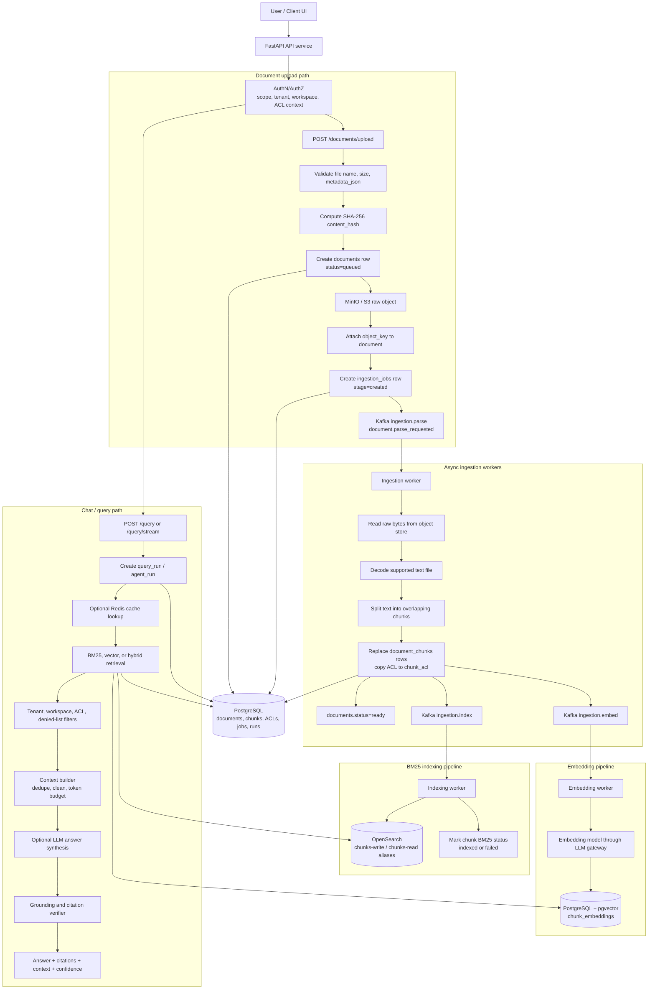

## Upload API Flow

Main endpoint: `POST /documents/upload`.

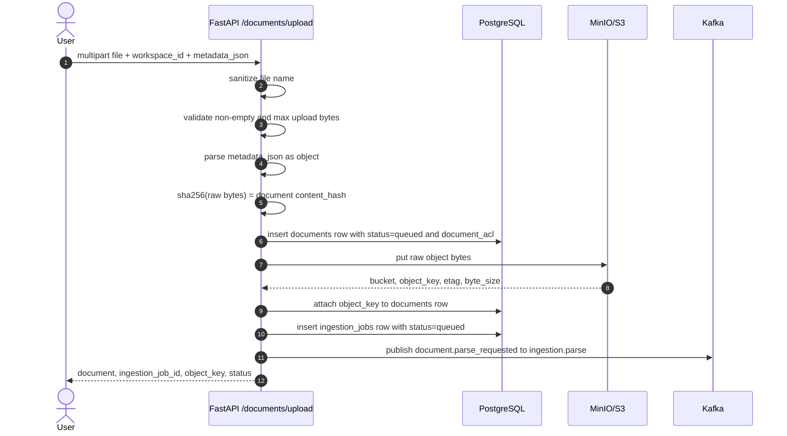

Important implementation details:

- The upload API reads the file bytes, computes `content_hash` with SHA-256,
  and stores the original file bytes in object storage.
- It creates a `documents` row before object upload, then attaches the
  `object_key` after upload succeeds.
- It creates one `ingestion_jobs` row for async processing.
- It publishes a Kafka event only if Kafka publishing is enabled.
- If object upload fails, the document is marked `failed`.
- If DB update after object upload fails, the API tries to delete the orphaned
  object.

## Object Store Keys

Current raw object key format:

```text
tenants/{tenant_id}/workspaces/{workspace_id_or_default}/documents/{document_id}/raw/{safe_file_name}
```

Example:

```text
tenants/tenant-a/workspaces/workspace-a/documents/11111111-1111-1111-1111-111111111111/raw/security-policy.md
```

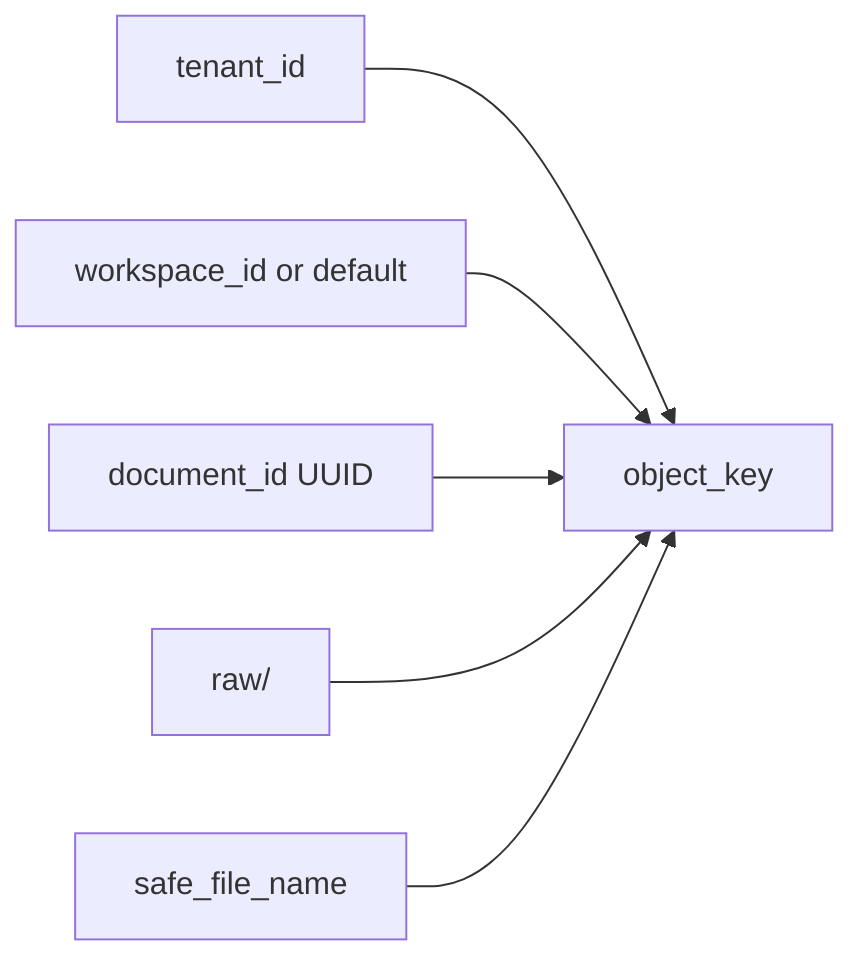

Current code does not store each chunk as an object-store object. Chunks are
stored as rows in `document_chunks`, indexed into OpenSearch, and optionally
embedded into `chunk_embeddings`.

If chunk-wise object storage is later added, use a deterministic key like:

```text
tenants/{tenant_id}/workspaces/{workspace_id_or_default}/documents/{document_id}/chunks/v1/{chunk_index}-{chunk_id}.txt
```

That keeps object paths tenant-scoped, workspace-scoped, document-scoped, and
stable across retries.

## Chunk Keys and IDs

When an interviewer asks "what is the key of each chunk?", answer with the
different keys used by different storage systems:

| Storage/system | Key |
|---|---|
| PostgreSQL chunk primary key | `document_chunks.id` UUID |
| Stable chunk order inside a document | unique `(document_id, chunk_index)` |
| Dedup/staleness key | `content_hash = sha256(chunk.content)` |
| OpenSearch BM25 document ID | `_id = chunk_id` |
| Embedding uniqueness | unique `(chunk_id, embedding_model, vector_version)` |
| Tenant/workspace filtering | `tenant_id`, `workspace_id` |
| ACL filtering | `chunk_acl` plus `acl_version`, allow lists, deny lists |

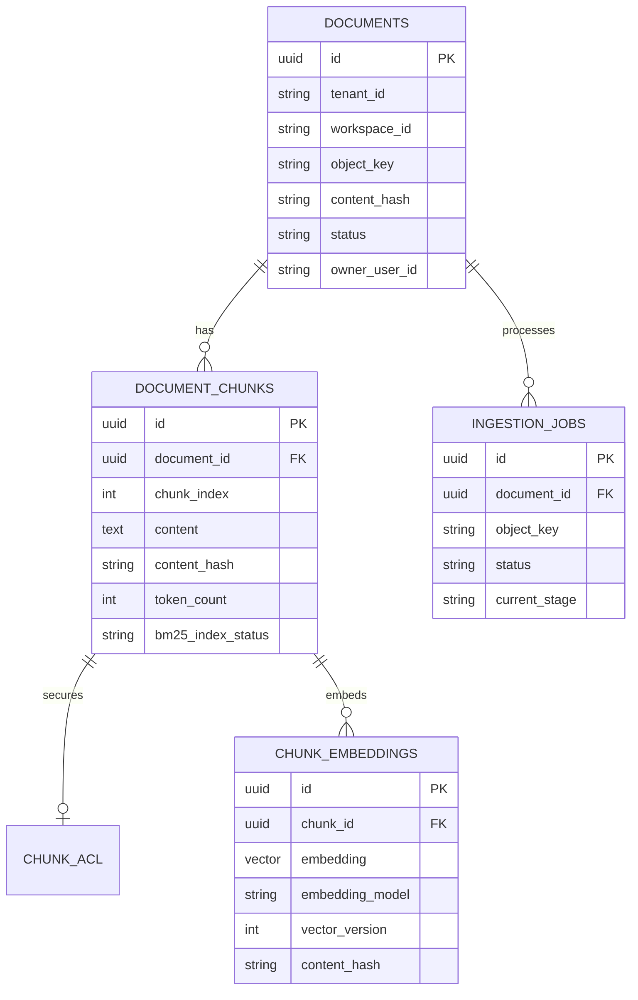

## Ingestion Worker Flow

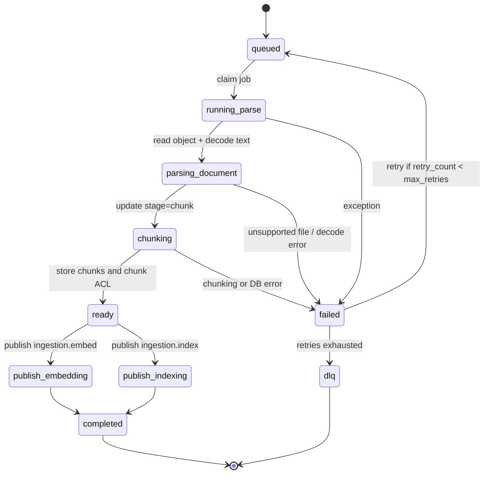

Detailed steps:

1. The worker claims a queued job using a lease. PostgreSQL can use
   `FOR UPDATE SKIP LOCKED` so multiple workers do not process the same job.
2. It reads `job.object_key` from MinIO/S3.
3. It decodes the file as UTF-8 text if the MIME type or extension is supported.
4. It chunks text using character windows with overlap. Defaults are
   `INGESTION_CHUNK_SIZE=2000` and `INGESTION_CHUNK_OVERLAP=200`.
5. It stores chunks in `document_chunks` and copies document ACL to `chunk_acl`.
6. It marks the document `ready`.
7. It publishes embedding and BM25 indexing events.
8. On failure, it stores error details, schedules retry with backoff, or sends
   to DLQ after retries are exhausted.

## Embedding and Vector DB Flow

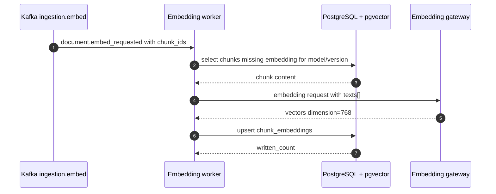

Current pgvector storage:

```text
chunk_embeddings.embedding = Vector(768)
unique key = (chunk_id, embedding_model, vector_version)
```

Current code enables pgvector and stores vectors. It also creates B-tree indexes
for metadata filters such as tenant, model, document, and chunk. The current
migration does not define an explicit ANN vector index such as HNSW or IVFFlat.
For a production-scale interview answer, say:

```text
Yes, the vector DB should be indexed. For pgvector we add an ANN index on
chunk_embeddings.embedding, usually HNSW with vector_cosine_ops, and keep
B-tree filters on tenant_id, embedding_model, vector_version, workspace_id,
and document_id.
```

Example production index:

```sql
CREATE INDEX CONCURRENTLY ix_chunk_embeddings_embedding_hnsw
ON chunk_embeddings
USING hnsw (embedding vector_cosine_ops);
```

The query path generates an embedding for the user query, then searches:

```text
ORDER BY chunk_embeddings.embedding <=> query_embedding
```

That returns nearest chunks by cosine distance, after tenant, workspace,
document, metadata, and ACL filtering.

## BM25 Indexing Flow

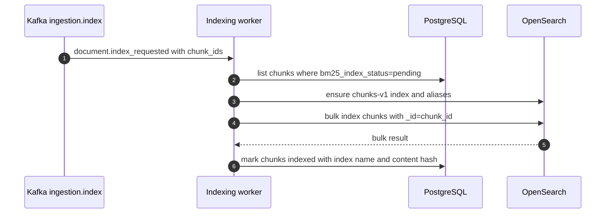

OpenSearch document shape for each chunk includes:

- `tenant_id`, `workspace_id`, `document_id`, `chunk_id`
- `content`, `document_title`, `file_name`
- `section_path`, `page_number`, offsets, token count
- document and chunk metadata
- ACL fields such as visibility, allowed users/groups/roles, denied users/groups
- classification and ACL version

OpenSearch uses `chunks-write` for writes and `chunks-read` for search. This
makes future blue/green reindexing easier because the application can write to
or read from aliases instead of hard-coding a physical index forever.

## What Is BM25?

BM25 is a lexical ranking algorithm used by search engines. It ranks a document
or chunk based on how well the query terms match the text.

In simple terms:

- If a query term appears in a chunk, the chunk becomes more relevant.
- Rare terms are weighted higher than common terms. This is the IDF part.
- Repeating a term helps, but the gain saturates. This prevents keyword spam.
- Very long chunks are normalized so they do not win only because they contain
  more words.

Typical BM25 scoring idea:

```text
score(query, chunk) = sum over query terms:
  IDF(term) * term_frequency_saturation * length_normalization
```

OpenSearch handles the inverted index and BM25 scoring internally. In this repo
the BM25 query uses a `multi_match` search over:

```text
content^3, document_title^2, file_name
```

So chunk content has the highest score impact, title has medium impact, and file
name helps as a smaller signal.

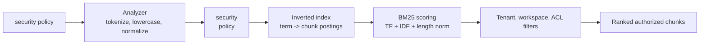

## Chat / Query Flow

There are two query styles:

| Endpoint | Behavior |
|---|---|
| `POST /query` | Non-streaming strategy-aware query path for BM25, vector, or hybrid retrieval |
| `POST /query/stream` | Streaming LangGraph agent runtime path |
| `POST /retrieval/bm25-search` | Direct BM25 retrieval API |
| `POST /retrieval/vector-search` | Direct vector retrieval API |
| `POST /retrieval/hybrid-search` | Direct hybrid retrieval API |
| `POST /retrieval/rerank` | Direct reranker API |

### Non-Streaming Query

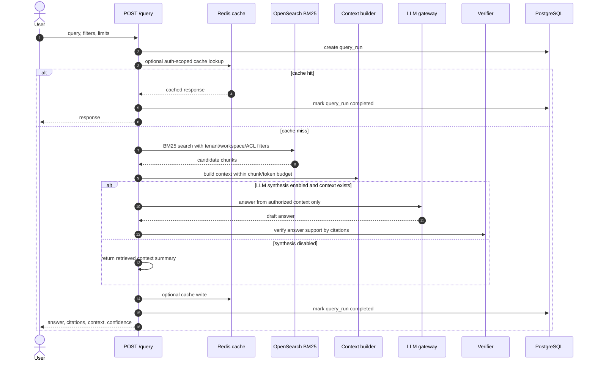

### Streaming Agent Query

The streaming path uses a LangGraph-style workflow:

```mermaid
flowchart LR
    Start([Start]) --> Intent["classify_intent"]
    Intent --> Rewrite["rewrite_query"]
    Rewrite --> Plan["plan_filters"]
    Plan --> Strategy["select_retrieval_strategy"]
    Strategy --> BM25["bm25_search"]
    BM25 --> Context["build_context"]
    Context --> Generate["generate_answer"]
    Generate --> Verify["verify_grounding"]
    Verify --> End([End])
```

Current strategy selection sets BM25. The design already has schemas and APIs
for vector and hybrid retrieval, so the next step is to make the strategy node
choose between BM25, vector, and hybrid based on query intent, filters, and
confidence.

The agent runtime protects the system with guardrails:

- max steps
- max tool calls
- total timeout
- per-step timeout
- repeated tool-call detection
- no answer generation without authorized context
- cancellation checks from the database

## Retrieval Strategies

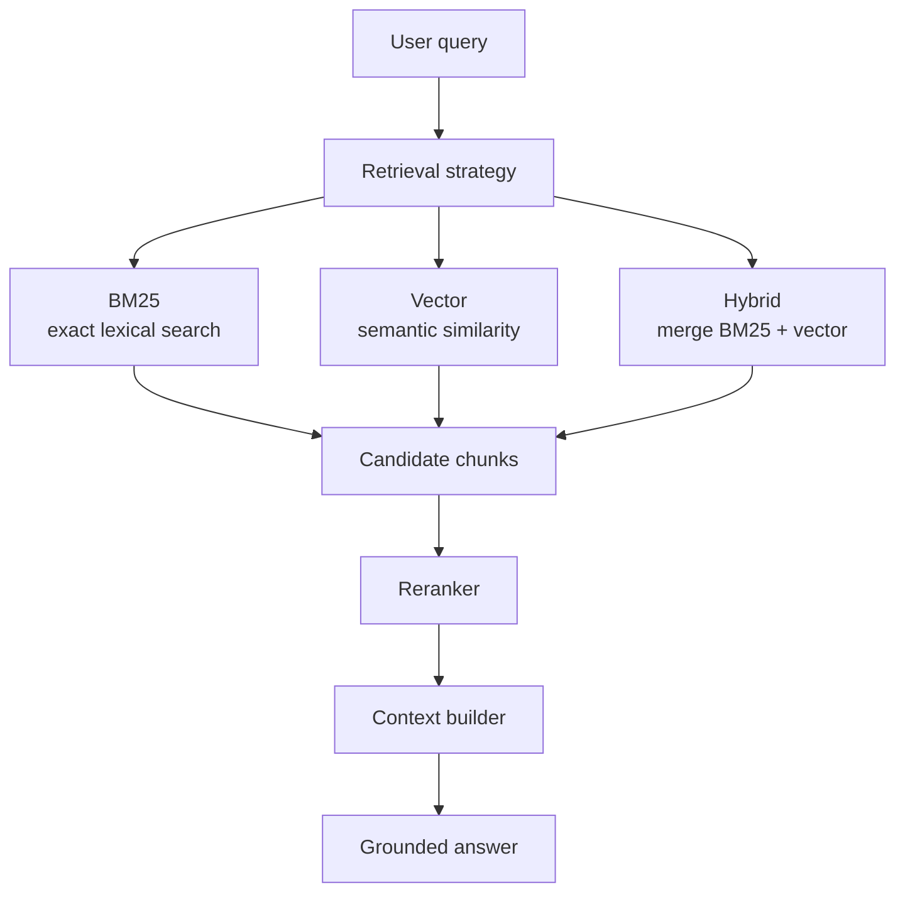

BM25 is best for exact keywords, codes, names, IDs, and terms that must match
literally.

Vector search is best for semantic similarity, paraphrases, and cases where the
query uses different wording from the document.

Hybrid search runs both BM25 and vector search, merges candidates by rank, then
reranks. In this repo, the hybrid merge gives each retrieval source a
rank-based contribution like `0.5 / rank`, deduplicates by `chunk_id`, and then
passes candidates to the reranker.

## Context Building and Citations

The context builder does not blindly send all chunks to the LLM. It:

1. Keeps only the top candidates within `max_context_chunks`.
2. Deduplicates by chunk ID.
3. Deduplicates repeated normalized content.
4. Removes HTML tags and normalizes whitespace.
5. Truncates to `max_context_tokens`.
6. Creates citations with `document_id`, `chunk_id`, title, URI, page, section,
   quote, and score.

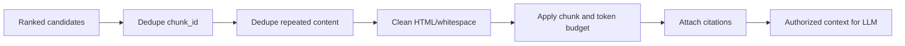

## Security and ACL Flow

Every retrieval path is tenant-scoped and authorization-scoped.

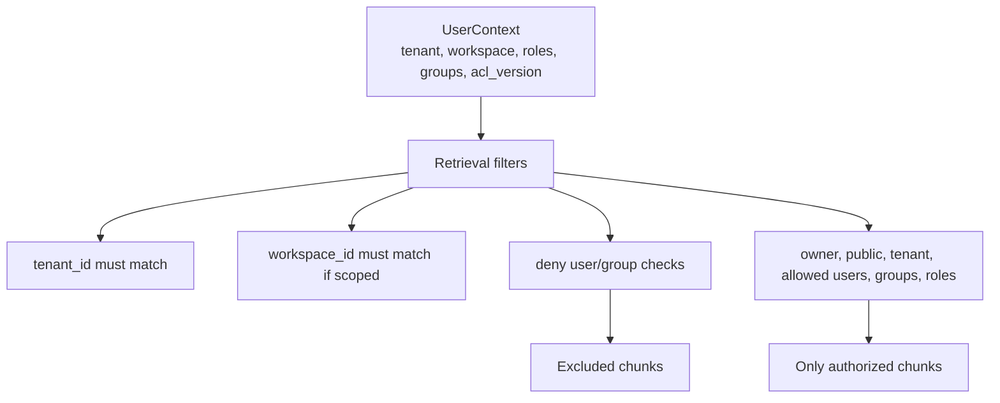

The LLM only sees context after retrieval filtering. This is important because
authorization must happen before prompt construction, not after answer
generation.

## Query Cache Key

If Redis query caching is enabled, the cache key is authorization-scoped. The
hash includes:

- tenant ID
- workspace ID
- user ID
- roles and groups
- scopes
- ACL version
- query text
- filters
- retrieval limits
- context limits
- retrieval strategy
- LLM synthesis flag and model config

Format:

```text
{QUERY_CACHE_KEY_PREFIX}:bm25:{sha256(canonical_payload)}
```

Default prefix:

```text
agentic-rag:query
```

This avoids returning an answer cached for one user or ACL version to a
different user.

## Failure and Retry Flow

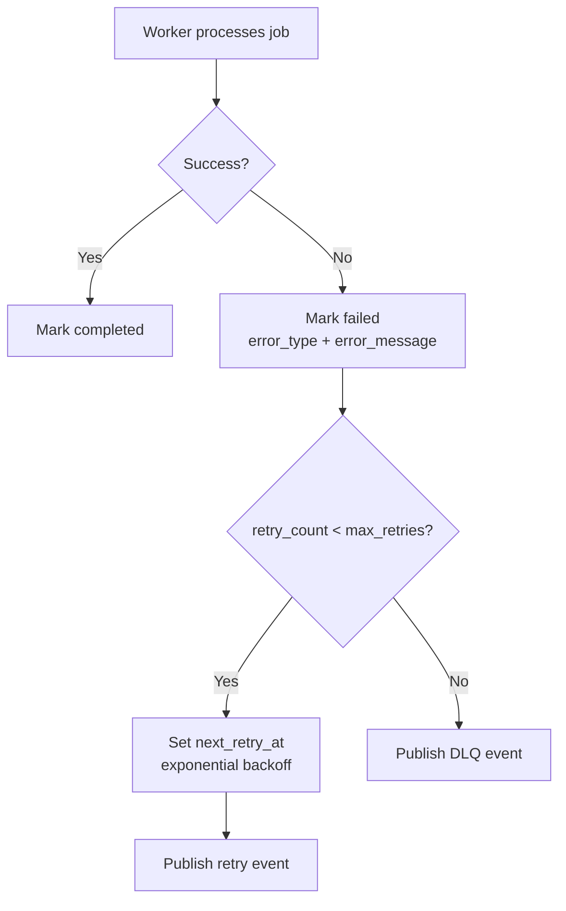

This matters in interviews because ingestion, embedding, and indexing are
expensive and long-running. They should not block the upload API request.

## Status Lifecycle

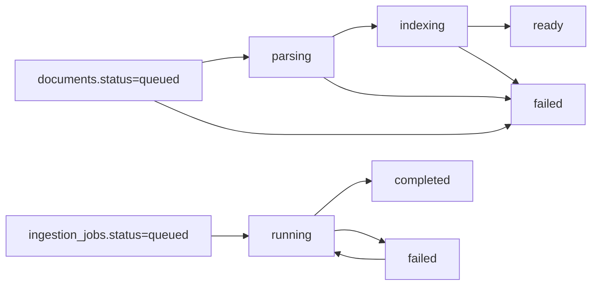

Chunk BM25 status:

```text
pending -> indexed
pending -> failed
failed -> pending on retry/reindex
```

## Interview Short Answers

### What happens when a user uploads a document?

The upload API validates the file, computes a SHA-256 content hash, creates a
`documents` row with ACL metadata, uploads the raw bytes to MinIO/S3, attaches
the object key to the document row, creates an `ingestion_jobs` row, and
publishes a Kafka parse event. The API returns quickly with the document ID,
job ID, and object key. Parsing, chunking, embedding, and BM25 indexing happen
asynchronously in workers.

### What is the object store key?

Current raw file key:

```text
tenants/{tenant_id}/workspaces/{workspace_id_or_default}/documents/{document_id}/raw/{safe_file_name}
```

Chunks are not currently stored as object-store files. Their primary key is
`document_chunks.id`; OpenSearch uses that same chunk ID as `_id`; embeddings
are keyed by `(chunk_id, embedding_model, vector_version)`.

### What is the key of each chunk?

The main key is `document_chunks.id`, a UUID. The stable order key is
`(document_id, chunk_index)`. The content staleness/dedup key is `content_hash`.
The BM25 index document ID is `chunk_id`. The vector uniqueness key is
`(chunk_id, embedding_model, vector_version)`.

### Do we use indexing in vector DB?

The repo uses pgvector and stores each embedding as `Vector(768)` in
`chunk_embeddings`. The current migration has pgvector enabled and B-tree
metadata indexes, but it does not yet create an HNSW/IVFFlat ANN vector index.
For production, add an HNSW index on `embedding vector_cosine_ops` plus keep
tenant/model/document filters.

### What is BM25?

BM25 is lexical search ranking. It scores chunks by matching query terms,
boosting rare terms, applying diminishing returns for repeated terms, and
normalizing by chunk length. OpenSearch builds the inverted index and calculates
BM25 scores. In this project we search `content^3`, `document_title^2`, and
`file_name`, then apply tenant/workspace/ACL filters.

### What happens when a user chats?

For `POST /query`, the API creates a query run, optionally checks Redis cache,
runs the requested retrieval strategy with ACL filters, builds a token-limited
context, optionally calls the LLM to synthesize an answer, verifies grounding
against citations, records the run, and returns the answer plus citations and
context.

For `POST /query/stream`, the API runs the LangGraph agent flow:
`classify_intent -> rewrite_query -> plan_filters -> select_retrieval_strategy
-> bm25_search -> build_context -> generate_answer -> verify_grounding`, and
streams events/tokens back to the client.

### Why not vectorize everything only?

For large datasets, vectorizing everything is expensive and can be weaker for
exact terms, IDs, product names, legal clauses, and rare keywords. This design
uses metadata and BM25 first, vector search where semantic matching helps, and
hybrid search when both signals are useful.

### Why async ingestion?

Parsing, chunking, embedding, and indexing can take seconds or minutes and can
fail independently. The upload API should stay fast. Kafka and workers provide
backpressure, retries, DLQs, horizontal scaling, and operational isolation.

### Where is authorization enforced?

Authorization is enforced before context reaches the LLM. Retrieval filters by
tenant, workspace, ACL version, denied users/groups, ownership, visibility, and
allowed users/groups/roles. Only authorized chunks are passed to context
building and answer generation.

## Production Improvements To Mention Honestly

These are good interview follow-ups because they show you understand the gap
between V1 and production scale:

- Add PDF, DOCX, HTML, image, and OCR parsers.
- Store extracted text and optional chunk text in object storage for very large
  documents, while keeping searchable text in DB/OpenSearch.
- Add a pgvector HNSW or IVFFlat ANN index.
- Add dynamic retrieval routing in the agent strategy node: BM25 vs vector vs
  hybrid.
- Add blue/green OpenSearch reindex jobs using aliases.
- Add idempotency to every worker event path.
- Add background re-embedding when embedding model or vector version changes.
- Add ingestion progress endpoint and UI.
- Add per-tenant quotas for uploads, embeddings, LLM tokens, and indexing.
- Add stronger reranker model in production; current reranker is deterministic
  term coverage logic.
